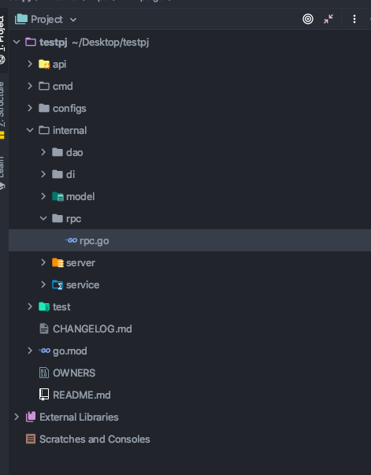
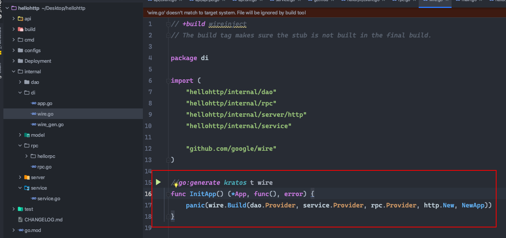
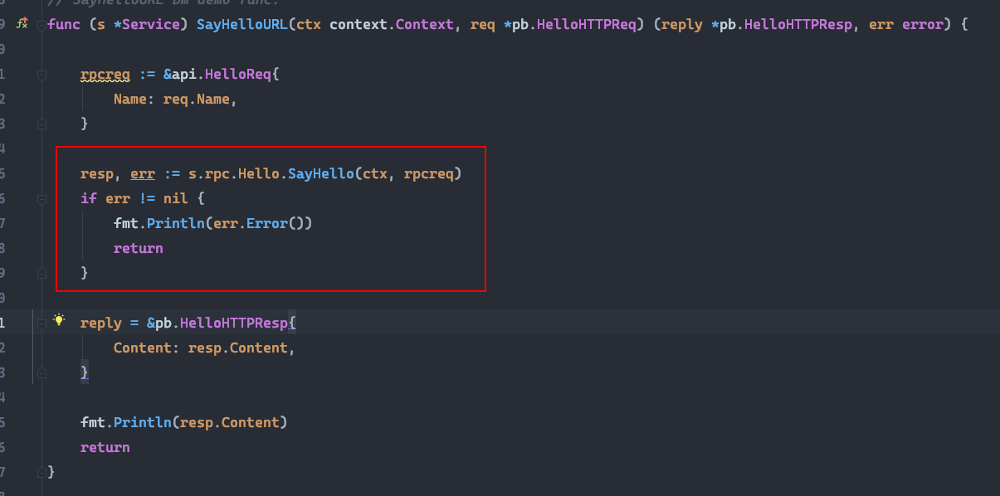

# 背景
kratos v0.3开始就提供了DI 依赖注入功能

主要用在APP服务依赖层(HTTP GRPC服务)的部分

V0.5进一步更新DI用于DAO层的部分

V0.7根据开发主线的roadmap 进一步把DI用于RPC层 并分割DAO和RPC的耦合

# 关于wire
wire是google cloud开发的一个依赖注入工具

kratos在v0.3的时候引入了这套工具 但是并没有写文档和特性介绍 因此很多人并不知道这个功能

wire的功能非常强大 不方便在这里用一句两句话来介绍 所以我放两篇写的比较好的文章给大家看

https://juejin.im/post/6844903901469097998

https://medium.com/@dche423/master-wire-cn-d57de86caa1b

# RPC依赖注入

先介绍一下v0.7版本的目录结构



可以发现 internal下面多了一个rpc文件夹

那么我们来看一下rpc.go里面写了什么

```go
package rpc

import (
	"gitlab.com/firerocksg/xy3-kratos/pkg/net/rpc/warden"
	xtime "gitlab.com/firerocksg/xy3-kratos/pkg/time"
	"github.com/google/wire"
	"google.golang.org/grpc"
	"time"
)

var Provider = wire.NewSet(
	InitConf,
	InitOpts,
	InitClient,
)

type Client struct {

}

func InitConf() *warden.ClientConfig {
	return &warden.ClientConfig{
		Timeout: xtime.Duration(time.Millisecond * 10000),
	}
}

func InitOpts() []grpc.DialOption {
	return nil
}

//把需要调用的RPC client作为参数输入到这里
func InitClient(/* type rpc.Client */) (c *Client, err error) {

	c = &Client{

	}

	return
}

```

这是生成出来默认的RPC目录 并没有任何服务Provider

比如说我现在有一个hellorpc的服务现在需要注入使用 那么我就对这个空Provider进行改造 只要加入我需要的服务

如下:

```go
package rpc

import (
	"gitlab.com/firerocksg/xy3-kratos/pkg/net/rpc/warden"
	xtime "gitlab.com/firerocksg/xy3-kratos/pkg/time"
	"github.com/google/wire"
	"google.golang.org/grpc"
	hello "hellohttp/internal/rpc/hellorpc"
	"time"
)

var Provider = wire.NewSet(
	InitConf,
	InitOpts,
	InitClient,
	hello.NewClient,
)

type Client struct {
	Hello hello.DemoClient
}

func InitConf() *warden.ClientConfig {
	return &warden.ClientConfig{
		Timeout: xtime.Duration(time.Millisecond * 10000),
	}
}

func InitOpts() []grpc.DialOption {
	return nil
}

func InitClient(hello hello.DemoClient) (c *Client, err error) {

	c = &Client{
		Hello: hello,
	}

	return
}
```

对比区别 非常简单 仅仅是引入一个client.go的hello.NewClient

**然后非常关键的地方 记得去internal/di目录下运行//go:generate kratos t wire**


重新生成依赖注入文件

由于新的service interface加入了RPC实现

所以我们在service里可以直接使用s.rpc.{rpcname}.{rpcservice}直接使用RPC调用其他服务

