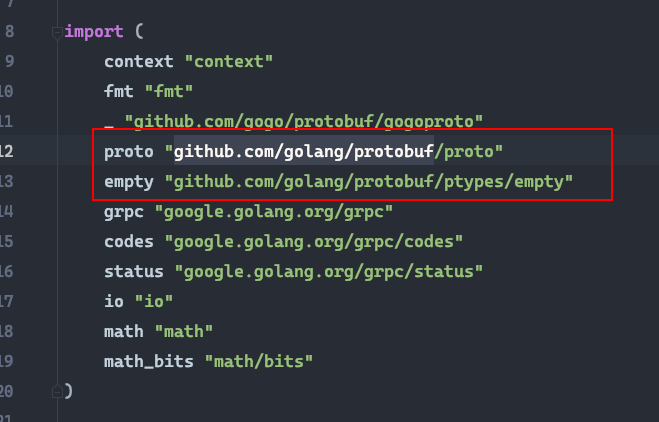
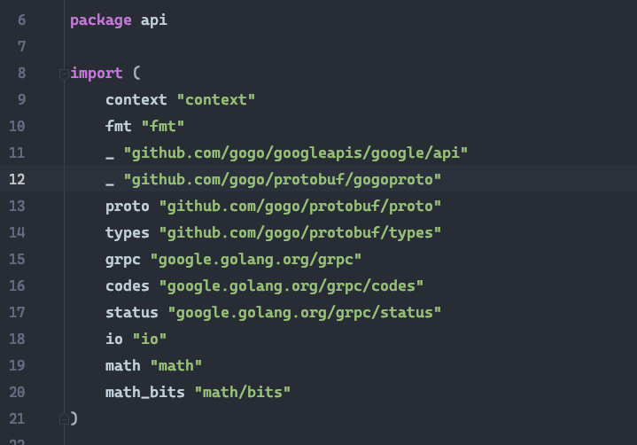

# 如何从旧版本升级到v0.7
无论你是v0.3或者以上 都可以非常便捷的升级到v0.7

0.2结构太老且没有依赖注入这些特性 因此不在一键升级的范畴之内

首先 先去$gopath/bin删除所有kratos有关的二进制文件 [安装v0.7的工具链](new-generator-tools.md)

**红色框标记的 请务必删除重新安装**


## 旧版本项目升级v0.7
当你已经更新了所有的kratos工具链之后

打开你的项目文件夹 安装v0.7版
```shell
go get -u gitlab.com/firerocksg/xy3-kratos
``` 

**之后 使用全量搜索替换** 

v0.3:
```
github.com/bilibili/kratos 替换为 gitlab.com/firerocksg/xy3-kratos
```

v0.5
```
github.com/go-kratos/kratos 替换为 gitlab.com/firerocksg/xy3-kratos
```

进入api目录下 删除旧版生成的文件如 api.pb.go , api.bm.go

然后打开你的api.proto文件

将三个默认的import
```protobuf
import "github.com/gogo/protobuf/gogoproto/gogo.proto";
import "google/protobuf/empty.proto";
import "google/api/annotations.proto";
```

修改为如下
```protobuf
import "gogoproto/gogo.proto";
import "protobuf/google/protobuf/empty.proto";
import "google/api/annotations.proto";
```

如果你还有用到google/protobuf的包 如 google/protobuf/timestamp.proto

请把前面的google/protobuf/修改为 protobuf/google/protobuf

这一切修改的目的是为了把proto文件的path全部指向gogo的包 用以移除golang/protobuf包的依赖

当你修改完毕了 使用 
```shell
kratos tool protoc --grpc --bm api.proto
```
重新生成PB和BM文件

之后查看你生成的PB文件

如果里面含有 github.com/golang/protobuf字段 说明修改的不够彻底 某些地方还引用了golang/protobuf包
例如红框标注的地方:



正确的生成代码是不含任何github.com/golang/protobuf字段的 例如




## 修改service

由于用到github.com/golang/protobuf的types的地方都被换成了gogo types

所以你的service里面引用的github.com/golang/protobuf types也需要换成gogo的

一般情况下只有ping这个service需要修改 例如:

注意import 

用github.com/gogo/protobuf/types替换github.com/golang/protobuf/ptypes/xxxx


service ping 修改:


如有引入其他的golang/protobuf/ptypes类型 请自行修改为gogo/protobuf/types


之后尝试重新启动一下你的服务 如果没有报错 那么恭喜你 你已经成功升级到了v0.7