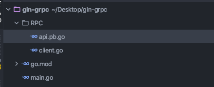

# 独立的warden client
由于v0.7重写了整个服务发现逻辑 因此我们把warden client独立出来 用于任意服务的调用

原本的warden client里面大量写死了服务发现逻辑 绑定到P2C和naming 导致非kratos框架不便使用

现在 你可以使用任何服务调用kratos的服务 使用warden client

以下使用gin demo来演示 如何使用gin框架去调用kratos的服务


# demo
首先准备了一个简单的 hellorpc的demo 包含client.go文件和生成好的api.pb.go文件

目录结构如下:



main.go

```go
package main

import (
	rpc "gin-grpc/RPC"
	"gitlab.com/firerocksg/xy3-kratos/pkg/naming/kubernetes"
	"gitlab.com/firerocksg/xy3-kratos/pkg/net/rpc/warden"
	xtime "gitlab.com/firerocksg/xy3-kratos/pkg/time"
	"gitlab.com/firerocksg/xy3-kratos/pkg/net/rpc/warden/resolver"
	"github.com/gin-gonic/gin"
	"time"
)

var (
	hellorpc rpc.DemoClient
)

func init() { 
	//服务发现解释器注册
	//resolver.Register(kubernetes.Builder())
	//resolver.Register(discovery.Builder())
	c,_:=rpc.NewClient(&warden.ClientConfig{Timeout: xtime.Duration(time.Millisecond * 10000)})
	hellorpc=c
}

func main() {
	r := gin.Default()
	r.GET("/hello", func(c *gin.Context) {

		resp,e:=hellorpc.SayHello(c,&rpc.HelloReq{
			Name:                 "yuki",
		})

		if e!=nil{
			c.JSON(500, gin.H{
				"message": "RPC error",
			})
			return
		}

		c.JSON(200, gin.H{
			"message": resp.Content,
		})
	})
	r.Run() // 监听并在 0.0.0.0:8080 上启动服务
}
```

非常简单 直接调用

甚至可以使用kubernetes discovery的服务发现 

你只需要把服务发现解释器注册上去即可 //resolver.Register(kubernetes.Builder())